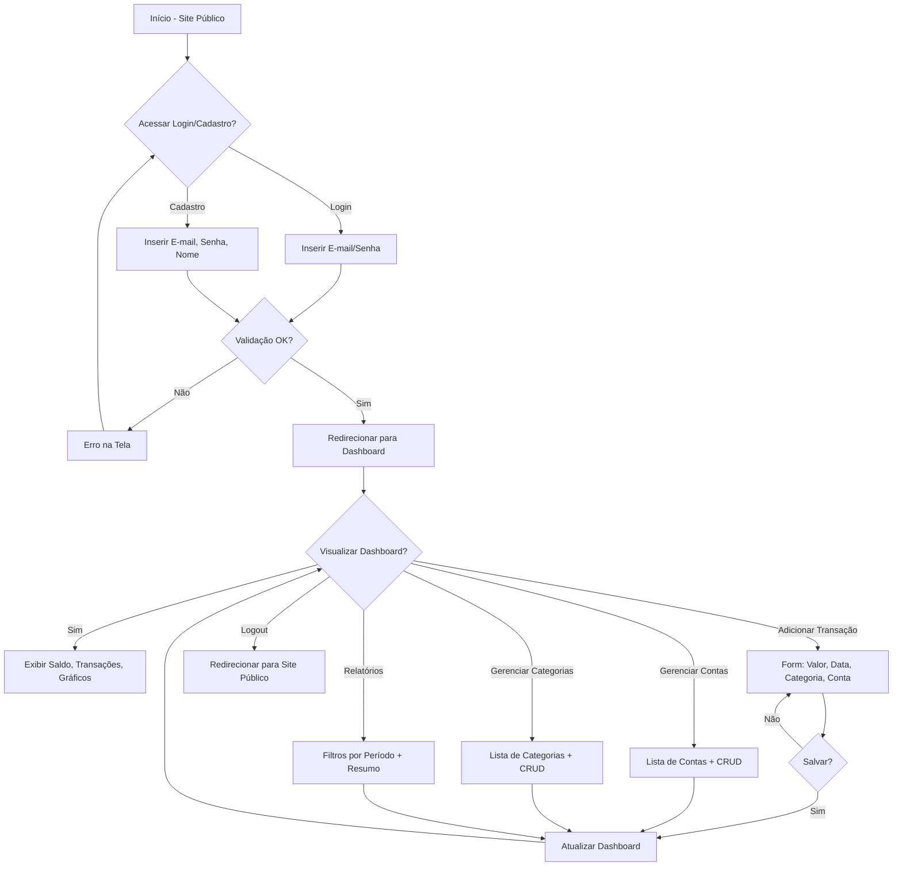
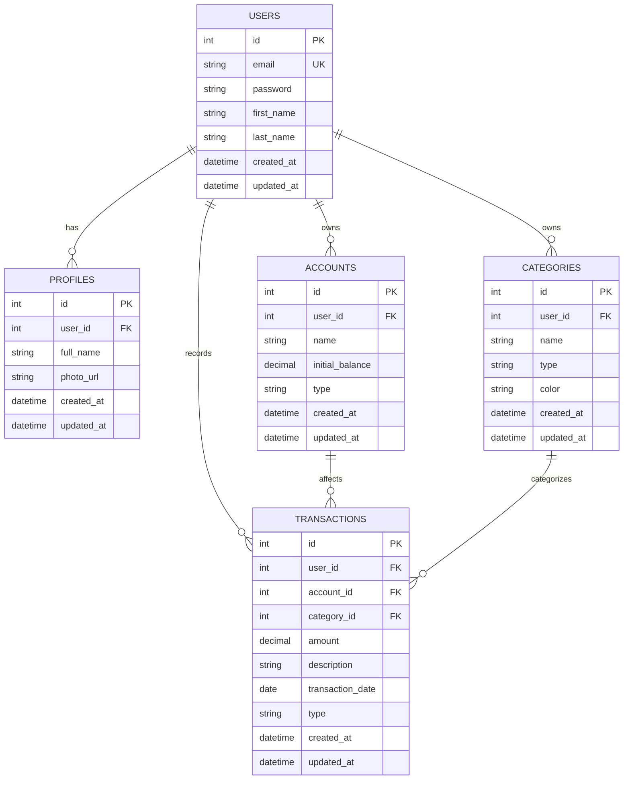

# Documento de Requisitos do Produto (PRD) - Finanpy

## Visão geral

O Finanpy é um sistema de gestão de finanças pessoais desenvolvido com Python e Django, focado em simplicidade e usabilidade. Ele permite que usuários registrem transações, gerenciem contas bancárias, categorizem despesas e receitas, e visualizem resumos financeiros em um dashboard intuitivo. O projeto adota uma abordagem full-stack com templates Django e TailwindCSS para um design moderno, responsivo e de tema escuro. A autenticação usa o sistema nativo do Django, com login via e-mail. O banco de dados é SQLite, e a estrutura é modularizada em apps Django para isolamento de responsabilidades. O escopo inicial é enxuto, sem Docker ou testes, priorizando funcionalidade básica.

## Sobre o produto

Finanpy é uma aplicação web para controle financeiro pessoal, construída para ser acessível e sem complexidades desnecessárias. Ele oferece um site público de apresentação com opções de cadastro e login, redirecionando usuários autenticados para um dashboard central. As entidades principais incluem usuários, perfis, contas bancárias, categorias e transações. Todo o conteúdo da interface é em português brasileiro, enquanto o código fonte é em inglês, seguindo PEP 8 e usando aspas simples.

## Propósito

O propósito do Finanpy é fornecer uma ferramenta simples e eficaz para que indivíduos gerenciem suas finanças diárias, promovendo hábitos financeiros saudáveis por meio de rastreamento de entradas e saídas, categorização e visualizações básicas. Ele visa reduzir a sobrecarga cognitiva com um design consistente e intuitivo, ajudando usuários a tomarem decisões informadas sem a necessidade de ferramentas complexas ou integrações externas.

## Público alvo

- Indivíduos adultos (25-50 anos) com renda pessoal ou familiar, interessados em controle financeiro básico.
- Usuários iniciantes em apps de finanças, que preferem interfaces simples e em português brasileiro.
- Pessoas com rotinas ocupadas, buscando mobilidade (responsivo) sem apps mobile dedicados.
- Residentes no Brasil, devido ao foco em português e finanças pessoais locais.

## Objetivos

- Permitir cadastro e login via e-mail em menos de 1 minuto.
- Oferecer um dashboard com resumo de saldo, transações recentes e gráficos simples.
- Garantir que 80% das ações (cadastro de transação, visualização de relatórios) sejam concluídas em 3 cliques ou menos.
- Manter o sistema leve e performático, com carregamento de páginas abaixo de 2 segundos.
- Evoluir para sprints finais com testes e containerização, mas priorizar MVP funcional.

## Requisitos funcionais

- **Autenticação**: Cadastro e login via e-mail usando Django Auth nativo. Site público com páginas de login/cadastro redirecionando para dashboard.
- **Dashboard Principal**: Após login, exibe saldo total, transações recentes (últimas 10), gráfico de pizza por categoria e saldo por conta.
- **Gerenciamento de Contas**: CRUD para contas bancárias (nome, saldo inicial, tipo: corrente/poupança/cartão).
- **Gerenciamento de Categorias**: CRUD para categorias de transações (nome, tipo: receita/despesa, cor personalizável).
- **Gerenciamento de Transações**: CRUD para entradas/saídas (valor, data, descrição, categoria, conta associada).
- **Perfis de Usuário**: Extensão do modelo User com campos adicionais (nome completo, foto opcional).
- **Relatórios Básicos**: Filtros por período (mês/ano) e resumo por categoria/conta.
- **Validações**: Campos obrigatórios em forms, valores numéricos positivos para receitas.

### Flowchart mermaid com os fluxos de UX

## Requisitos não-funcionais

- **Performance**: Páginas carregam em <2s; consultas SQL otimizadas para <100ms.
- **Segurança**: Autenticação Django nativa; CSRF e XSS protegidos; dados sensíveis (e-mails) hashed.
- **Usabilidade**: Design responsivo (mobile-first); acessibilidade básica (ARIA labels em forms).
- **Escalabilidade**: Inicialmente SQLite; modular para migração futura.
- **Manutenibilidade**: Código em apps isolados; signals em signals.py; CBVs preferenciais.
- **Idioma**: Interface 100% em PT-BR; código em inglês.
- **Compatibilidade**: Browsers modernos (Chrome, Firefox, Safari últimos 2 anos).

## Arquitetura técnica

### Stack

- **Backend**: Python 3.13+, Django 5.x (full-stack com CBVs).
- **Frontend**: Django Template Language + TailwindCSS (CDN ou estático).
- **Banco de Dados**: SQLite (padrão Django).
- **Autenticação**: Django Auth (customizado para e-mail como USERNAME_FIELD).
- **Outros**: Sem Docker/testes iniciais; signals em signals.py por app.

### Estrutura de dados com schemas em formato mermaid

## Design system

O design system é baseado em TailwindCSS, integrado via CDN nos templates base. Tema escuro com gradientes harmônicos (azul-indigo para primárias, cinza escuro para fundo). Todas as telas herdam de um template base (`base.html`) com header (logo, menu navegação, logout), sidebar (links para dashboard, contas, categorias, transações, relatórios) e footer simples. Layout responsivo com grid flexível.

- **Cores Primárias**: 
  - Primária: `bg-gradient-to-r from-indigo-600 to-blue-700` (botões de ação).
  - Secundária: `bg-purple-600` (ênfase em receitas).
  - Erro: `bg-red-600`, Sucesso: `bg-green-600`.
- **Cores de Fundo**: 
  - Fundo Principal: `bg-gray-900` (escuro).
  - Cards: `bg-gray-800` com borda `border-gray-700`.
  - Gradiente Hero: `bg-gradient-to-br from-gray-900 via-indigo-900 to-gray-900`.
- **Padrão de Botões**: 
  - Primário: `<button class="bg-gradient-to-r from-indigo-600 to-blue-700 hover:from-indigo-700 hover:to-blue-800 text-white px-4 py-2 rounded-md shadow-lg transition">Salvar</button>`.
  - Secundário: `<button class="bg-gray-700 hover:bg-gray-600 text-white px-4 py-2 rounded-md">Cancelar</button>`.
- **Inputs e Forms**: 
  - Input: `<input class="w-full bg-gray-800 border border-gray-700 rounded-md px-3 py-2 text-white placeholder-gray-400 focus:outline-none focus:ring-2 focus:ring-indigo-500">`.
  - Form: Wrapper com `bg-gray-800 p-6 rounded-lg shadow-md`.
- **Grids**: 
  - Layout Principal: `
` (sidebar 1 col, conteúdo 3 cols em desktop).
- **Menus**: 
  - Navbar: `<nav class="bg-gray-800 p-4 flex justify-between">` com links `text-white hover:text-indigo-400`.
  - Sidebar: `<aside class="bg-gray-700 w-64 p-4">` com lista vertical `space-y-2`.
- **Fontes**: 
  - Principal: `font-sans` (system-ui via Tailwind), tamanhos: h1 `text-3xl font-bold`, body `text-base`.

Templates usam `` para Tailwind via ``.

## User stories

### Épico 1: Autenticação e Onboarding
- Como usuário novo, quero me cadastrar via e-mail para acessar o sistema.
- Como usuário existente, quero logar via e-mail para entrar no dashboard.
- Critérios de Aceite: 
  - Formulário de cadastro valida e-mail único e senha forte.
  - Login falha com credenciais inválidas, redireciona com mensagem de erro.
  - Após login, redireciona para /dashboard/.
  - Logout limpa sessão e volta ao site público.

### Épico 2: Dashboard e Visualizações
- Como usuário logado, quero ver resumo de finanças no dashboard.
- Critérios de Aceite: 
  - Exibe saldo total, últimas 10 transações em tabela.
  - Gráfico de pizza (usando Chart.js básico) por categoria.
  - Responsivo, atualiza em tempo real após ações.

### Épico 3: Gerenciamento de Contas
- Como usuário, quero adicionar/editar/excluir contas bancárias.
- Critérios de Aceite: 
  - Lista paginada de contas com saldo atual.
  - Form com validação de saldo numérico.
  - Atualiza saldo total no dashboard.

### Épico 4: Gerenciamento de Categorias e Transações
- Como usuário, quero criar categorias e registrar transações.
- Critérios de Aceite: 
  - CRUD para categorias com cor Tailwind.
  - Form de transação associa conta/categoria, calcula saldo.
  - Filtros por data/tipo em lista de transações.

### Épico 5: Relatórios
- Como usuário, quero filtrar relatórios por período.
- Critérios de Aceite: 
  - Tabela/resumo por categoria/conta.
  - Exportação básica para CSV (opcional em sprint final).

## Métricas de sucesso

- **KPIs de Produto**: Taxa de retenção semanal >70%; Tempo médio de sessão >5min; Taxa de conclusão de transações >90%.
- **KPIs de Usuário**: Número de usuários ativos (logins/mês) >50 no MVP; NPS >7/10 via feedback simples.
- **KPIs Técnicos**: Tempo de carregamento <2s (medido via browser devtools); Erros de autenticação <1%.
- **KPIs de Engajamento**: Transações cadastradas por usuário >5/semana; Visualizações de dashboard >3/sessão.

## Risco e mitigações

- **Risco: Vazamento de dados sensíveis (e-mails, saldos)**. Mitigação: Usar autenticação Django hashed; auditoria manual de código; educar usuários sobre senhas fortes.
- **Risco: Performance lenta com SQLite em crescimento**. Mitigação: Otimizar queries com select_related; monitorar via Django debug toolbar; planejar migração para Postgres em v2.
- **Risco: Design inconsistente**. Mitigação: Template base obrigatório; revisão de PRs para adesão ao design system.
- **Risco: Atraso em sprints por over-engineering**. Mitigação: Definir escopo granular; reuniões semanais curtas; priorizar MVP sem features extras.
- **Risco: Baixo engajamento inicial**. Mitigação: Onboarding guiado; e-mails de boas-vindas; métricas semanais.

## Lista de tarefas

### Sprint 1: Setup Inicial e Autenticação (Semana 1-2) [X]
- [X] Configurar projeto Django base
  - [X] Criar virtualenv e instalar Django 5.x via pip.
  - [X] Executar `django-admin startproject core .` e ajustar settings.py para apps (accounts, categories, core, profiles, transactions, users).
  - [X] Configurar LANGUAGE_CODE='pt-br' e TIME_ZONE='America/Sao_Paulo' em settings.py.
  - [X] Adicionar apps instalados em INSTALLED_APPS.
- [X] Customizar modelo User para e-mail
  - [X] Em users/models.py, subclass AbstractUser com USERNAME_FIELD='email' e REQUIRED_FIELDS=[].
  - [X] Em users/admin.py, registrar User customizado.
  - [X] Criar migração inicial com `python manage.py makemigrations users` e `migrate`.
- [X] Implementar views e templates de autenticação
  - [X] Em users/views.py, criar CBV LoginView e SignupView usando CreateView para User.
  - [X] Configurar urls.py em core e users para /login/, /signup/, /logout/.
  - [X] Criar templates base.html com Tailwind CDN, header e footer escuros.
  - [X] Criar login.html e signup.html com forms em PT-BR, inputs Tailwind e botão gradiente.
- [X] Site público
  - [X] Em core/views.py, criar TemplateView para home pública com links para login/signup.
  - [X] Template home.html com hero gradiente e chamadas para ação.

### Sprint 2: Perfis e Dashboard Básico (Semana 3) [X]
- [X] Modelo Profile
  - [X] Em profiles/models.py, criar Profile com OneToOneField para User, full_name, photo.
  - [X] Adicionar created_at/updated_at via mixin ou auto_now.
  - [X] Makemigrations e migrate para profiles.
- [X] Signal para criar Profile automático
  - [X] Em profiles/signals.py, post_save para User criando Profile.
  - [X] Em profiles/apps.py, importar signals em ready().
- [X] Dashboard View
  - [X] Em core/views.py, LoginRequiredMixin + TemplateView para /dashboard/.
  - [X] Template dashboard.html com grid Tailwind, seções para saldo e transações placeholder.
  - [X] Adicionar menu sidebar com links para seções futuras.

### Sprint 3: Contas Bancárias (Semana 4) [X]
- [X] Modelo Account
  - [X] Em accounts/models.py, Account com ForeignKey User, name, initial_balance, type choices.
  - [X] Adicionar created_at/updated_at.
  - [X] Makemigrations e migrate.
- [X] Admin para Account
  - [X] Em accounts/admin.py, registrar Account com list_display e filters.
- [X] CRUD Views para Accounts
  - [X] Em accounts/views.py, ListView, CreateView, UpdateView, DeleteView com LoginRequiredMixin.
  - [X] Forms em forms.py com ModelForm, validações numéricas.
  - [X] Urls em accounts/urls.py.
  - [X] Templates: account_list.html (tabela Tailwind), form.html genérico com inputs.
- [X] Integrar no Dashboard
  - [X] Query para saldo total em dashboard view.

### Sprint 4: Categorias (Semana 5) [X]
- [X] Modelo Category
  - [X] Em categories/models.py, Category com FK User, name, type choices, color (CharField com Tailwind classes).
  - [X] created_at/updated_at.
  - [X] Makemigrations e migrate.
- [X] Admin para Category
  - [X] Registrar em admin.py com filters por type.
- [X] CRUD Views
  - [X] Similar a Accounts: List/Create/Update/Delete CBVs.
  - [X] Template com preview de cor em botões.
- [X] Sidebar link para /categories/.

### Sprint 5: Transações (Semana 6) [X]
- [X] Modelo Transaction
  - [X] Em transactions/models.py, Transaction com FKs para User/Account/Category, amount, description, date, type.
  - [X] created_at/updated_at.
  - [X] Makemigrations e migrate.
- [X] Admin para Transaction
  - [X] Registrar com inline para Account/Category.
- [X] CRUD Views
  - [X] ListView com filtro por data; Create/Update/Delete com choices populados.
  - [X] Form com cálculo de saldo pós-transação via signal.
- [X] Signal para atualizar saldo Account
  - [X] Em accounts/signals.py, post_save para Transaction atualizando account.balance.
- [X] Integrar no Dashboard
  - [X] Query para últimas 10 transações em tabela.
  - [X] Link para adicionar transação rápida.

### Sprint 6: Relatórios e Polimento (Semana 7) [X]
- [X] Relatórios View
  - [X] Em core/views.py, TemplateView com filtros GET (data_inicio, data_fim).
  - [X] Query agregada por categoria/conta usando annotate.
  - [X] Template report.html com tabela e gráfico placeholder (div para Chart.js futuro).
- [X] Polir UX
  - [X] Adicionar mensagens flash (Django messages) em PT-BR para ações CRUD.
  - [X] Garantir responsividade em todos templates.
  - [X] Testar fluxos end-to-end manualmente.
- [X] Preparar para Sprints Finais
  - [X] Documentar pendências: Docker, testes unitários, Chart.js integração.

### Sprint 7: Documentação e Entrega Final (Semana 9) [X]

* [X] **Documentação Técnica**

  * [X] Criar arquivo `README.md` na raiz do projeto contendo:

    * Descrição geral do sistema.
    * Requisitos mínimos (Python, Django, dependências).
    * Instruções para instalação, configuração e execução local.
    * Estrutura de diretórios e explicação de cada app.
    * Contato ou autoria do projeto.
  * [X] Adicionar instruções para migrações (`makemigrations`, `migrate`) e criação de superusuário.
  * [X] Criar seção sobre como contribuir (pull requests, convenções de commit).
  * [X] Gerar diagrama de arquitetura (via Mermaid) no README para ilustrar relação entre apps.
* [X] **Documentação de APIs e Rotas**

  * [X] Criar `docs/routes.md` descrevendo todas as URLs principais:

    * `/login/`, `/signup/`, `/logout/`, `/dashboard/`, `/accounts/`, `/categories/`, `/transactions/`, `/reports/`.
    * Métodos suportados (GET/POST/DELETE).
    * Requisitos de autenticação.
  * [X] Incluir exemplos de payloads e respostas JSON quando aplicável (transações e contas).
* [X] **Documentação de Modelos**

  * [X] Criar `docs/models.md` com:

    * Descrição dos modelos (User, Profile, Account, Category, Transaction).
    * Campos e relacionamentos (FKs, tipos, restrições).
    * Notas sobre signals (`post_save` para criação de Profile e atualização de saldo).
* [X] **Guia de Estilo de Código**

  * [X] Criar `docs/conventions.md` com:

    * Convenções de nomenclatura (snake_case para variáveis, PascalCase para classes).
    * Uso de aspas simples e importações ordenadas (PEP 8).
    * Preferência por CBVs e uso de `LoginRequiredMixin`.
    * Estrutura modular de apps e uso de `signals.py` separado.
* [X] **Documentação de Interface**

  * [X] Capturar capturas de tela (screenshots) das principais telas: login, dashboard, contas, categorias, transações.
  * [X] Criar `docs/ui.md` com:

    * Layout geral (base.html, sidebar, header, footer).
    * Paleta de cores e classes Tailwind mais usadas.
    * Padrões de formulários, botões e responsividade.
* [X] **Histórico de Versões**

  * [X] Criar `CHANGELOG.md` com:

    * Registro das principais alterações por sprint.
    * Data, descrição e autor.
  * [X] Incluir marcações de versão (ex: `v0.1.0` para MVP final).
* [X] **Checklist de Entrega**

  * [X] Verificar que todos os templates estão traduzidos para PT-BR.
  * [X] Garantir que os arquivos estáticos (CSS/JS) estão corretamente servidos.
  * [X] Confirmar que não há dados sensíveis hardcoded.
  * [X] Revisar consistência visual e tipográfica.
  * [X] Testar execução completa em ambiente limpo (sem dependências prévias).

### Sprint Final: Docker e Testes (Semana 8+) [X]
- [X] Dockerização
  - [X] Criar Dockerfile para Django + SQLite.
  - [X] docker-compose.yml com volumes para db.sqlite.
- [X] Testes Básicos
  - [X] Em tests.py de cada app, tests para models e views (pytest ou Django TestCase).
  - [X] Cobertura >70% para autenticação e CRUD.
