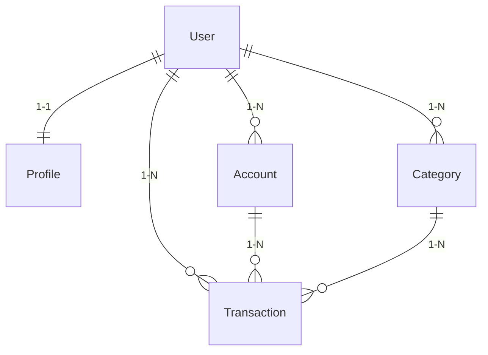

# Finanpy

Finanpy é uma aplicação web de finanças pessoais construída com Django 5 e tema escuro totalmente em português brasileiro. Ela permite que usuários cadastrem contas bancárias, categorias e transações, oferecendo um dashboard simples para visualizar saldo consolidado, receitas, despesas e relatórios básicos.

## Sumário
- [Visão Geral](#visão-geral)
- [Requisitos](#requisitos)
- [Configuração Rápida](#configuração-rápida)
- [Estrutura de Diretórios](#estrutura-de-diretórios)
- [Migrações e Superusuário](#migrações-e-superusuário)
- [Execução com Docker](#execução-com-docker)
- [Contribuição](#contribuição)
- [Autoria e Contato](#autoria-e-contato)

## Visão Geral
- **Stack**: Python 3.13+, Django 5.2, SQLite, TailwindCSS via CDN.
- **Principais Recursos**:
  - Autenticação por e-mail (login, cadastro, logout).
  - Dashboard com saldo geral, transações recentes e totais por categoria e conta.
  - CRUD completo para contas bancárias, categorias e transações.
  - Relatórios com filtros por período e agregações.
  - Tema escuro responsivo seguindo diretrizes do PRD.

## Requisitos
- Python 3.13 ou superior.
- Pip e virtualenv (opcionais, porém recomendados).
- Dependências listadas em `requirements.txt`.
- Para recursos de imagens em `profiles`, biblioteca Pillow já incluída nas dependências.

## Configuração Rápida

```bash
# 1. Criar e ativar ambiente virtual (recomendado)
python -m venv .venv
source .venv/bin/activate  # Linux/Mac
# .venv\Scripts\activate   # Windows PowerShell

# 2. Instalar dependências
pip install --upgrade pip
pip install -r requirements.txt

# 3. Aplicar migrações do Django
python manage.py migrate

# 4. Executar servidor local
python manage.py runserver
```

Após iniciar, acesse `http://127.0.0.1:8000/`.

## Estrutura de Diretórios
```
├── accounts/        # Domínio de contas bancárias, signals de saldo
├── categories/      # Domínio de categorias de receitas/despesas
├── core/            # Configurações globais, URLs e views compartilhadas
├── docs/            # Documentação extendida (rotas, modelos, UI, convenções)
├── profiles/        # Perfil do usuário (OneToOne com User)
├── transactions/    # Transações financeiras e integrações com contas/categorias
├── users/           # Custom User model (login por e-mail) e views de autenticação
├── templates/       # Templates organizados por app (via `APP_DIRS`)
├── Dockerfile       # Build containerizado da aplicação
├── docker-compose.yml # Ambiente Docker com volume para banco SQLite
└── CHANGELOG.md     # Histórico de versões
```

Diagrama de alto nível:



## Migrações e Superusuário

```bash
# Criar migrações (apenas quando modelos mudarem)
python manage.py makemigrations

# Aplicar migrações
python manage.py migrate

# Criar superusuário para acessar o admin
python manage.py createsuperuser --email admin@example.com
```

## Execução com Docker

```bash
# Build e subir serviços
docker-compose up --build

# A aplicação ficará disponível em http://127.0.0.1:8000
```

O volume nomeado `sqlite_data` garante persistência do `db.sqlite3`.

## Contribuição
1. Faça um fork ou trabalhe em branch dedicada.
2. Crie commits seguindo mensagens claras (ex.: `feat: add account export`).
3. Abra pull request descrevendo objetivo, alterações e passos de validação.
4. Valide testes com `python -m coverage run manage.py test` antes de enviar.

Outras diretrizes: consulte `docs/conventions.md`.

## Autoria e Contato
- **Autor**: Equipe Finanpy (jorge@finanpy.dev)
- **Documentação Complementar**:
  - `docs/routes.md`
  - `docs/models.md`
  - `docs/ui.md`
  - `docs/conventions.md`
  - `docs/development-setup.md`
