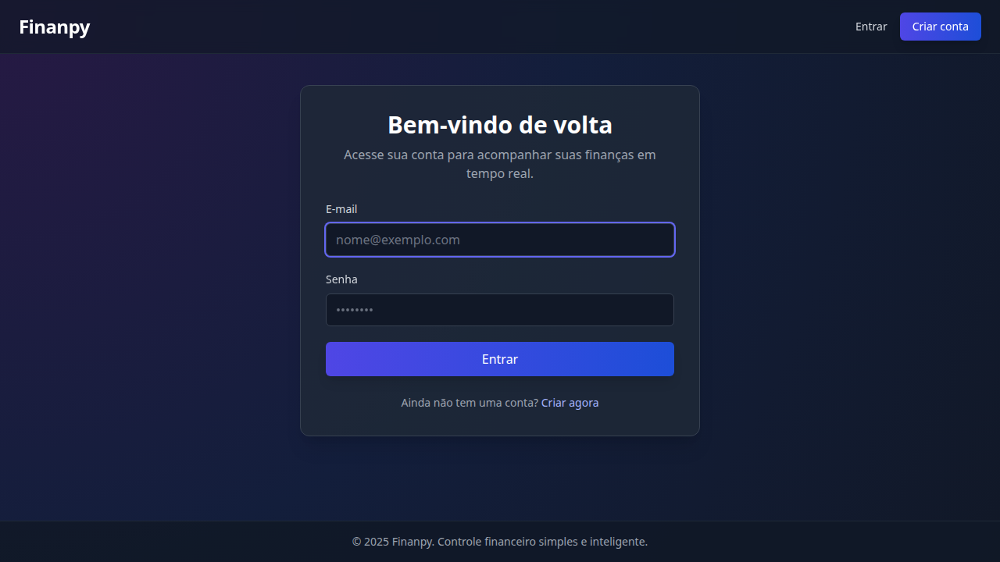
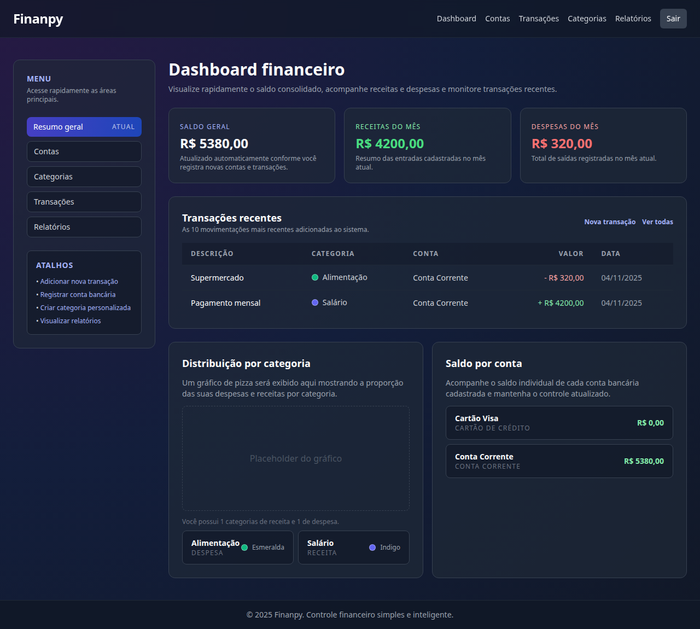
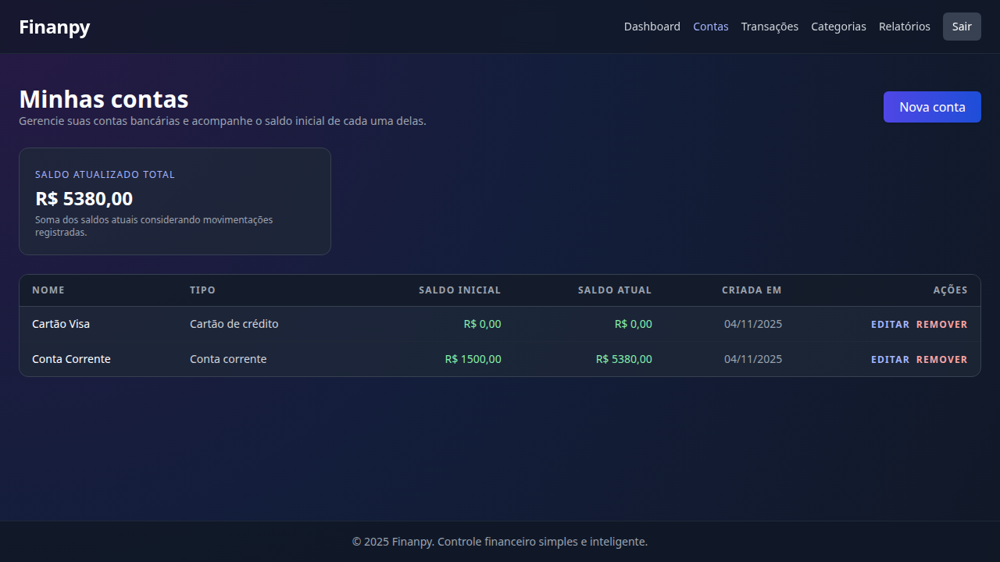
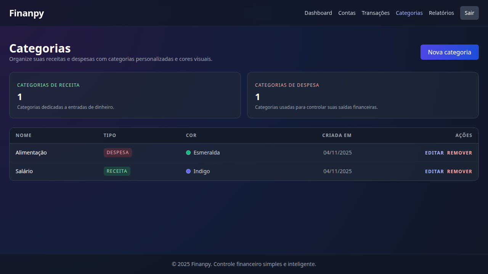
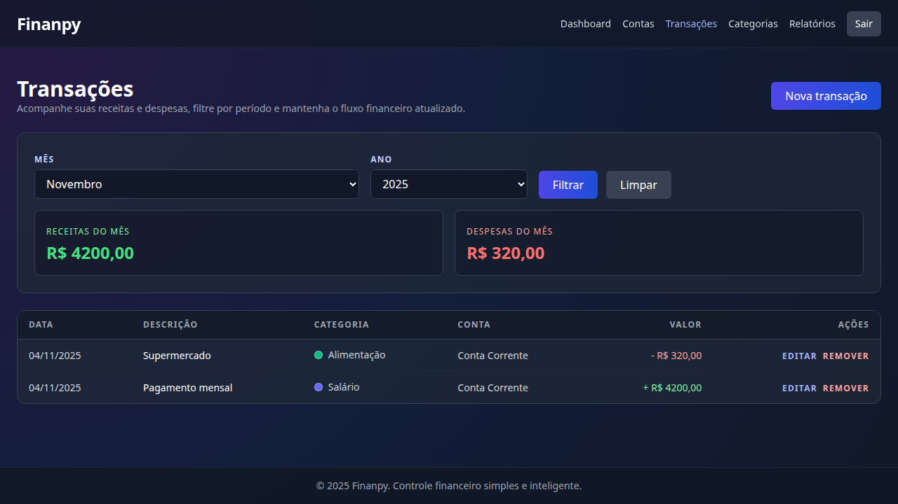

# Guia de Interface do Finanpy

## Layout Base
- Todos os templates herdam de `core/templates/base.html`.
- **Header**: logo Finanpy, links principais e botão de logout.
- **Sidebar** (em páginas autenticadas): navegação vertical com atalhos rápidos.
- **Footer**: crédito padrão `© 2025 Finanpy`.

## Paleta de Cores (Tailwind)
- Fundo principal: `bg-gray-900` com gradientes `from-indigo-900`.
- Cards: `bg-gray-800` com bordas `border-gray-700`.
- Botões primários: `bg-gradient-to-r from-indigo-600 to-blue-700`.
- Botões secundários: `bg-gray-700`.
- Estados: sucesso `bg-green-600`, erro `bg-red-600`.

## Componentes e Formulários
- Inputs: classe base `w-full bg-gray-800 border border-gray-700 rounded-md px-3 py-2 text-white`.
- Selects seguem as mesmas classes dos inputs.
- Botões principais utilizam gradiente + `hover` (`hover:from-indigo-700 hover:to-blue-800`).
- Mensagens de sucesso/erro exibidas via Django messages (PT-BR).

## Responsividade
- Grid principal usa `grid grid-cols-1 md:grid-cols-4` no dashboard.
- Sidebar recolhe em telas pequenas via menu superior.
- Formulários ocupam 100% da largura em mobile.

## Screenshots

| Tela | Prévia |
| --- | --- |
| Login |  |
| Dashboard |  |
| Contas |  |
| Categorias |  |
| Transações |  |

As imagens foram capturadas usando Playwright e ilustram o estado padrão com dados de exemplo.
